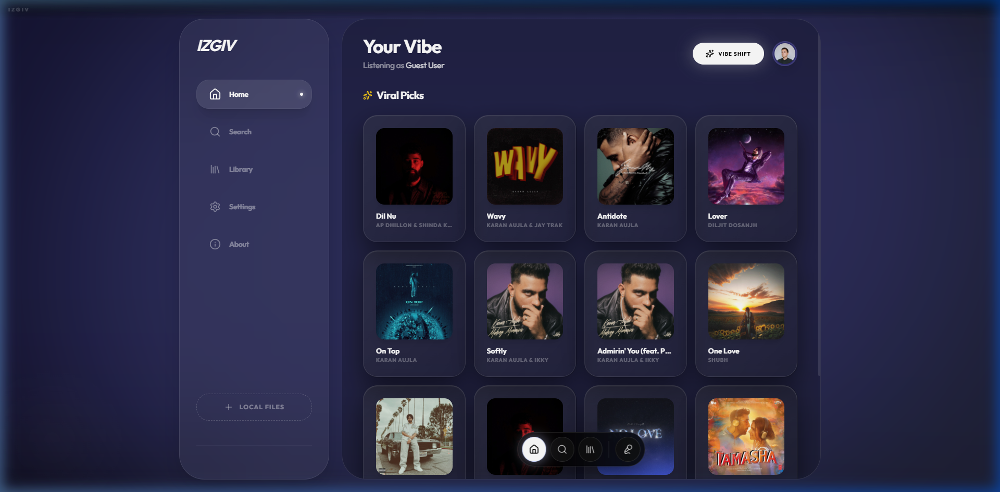
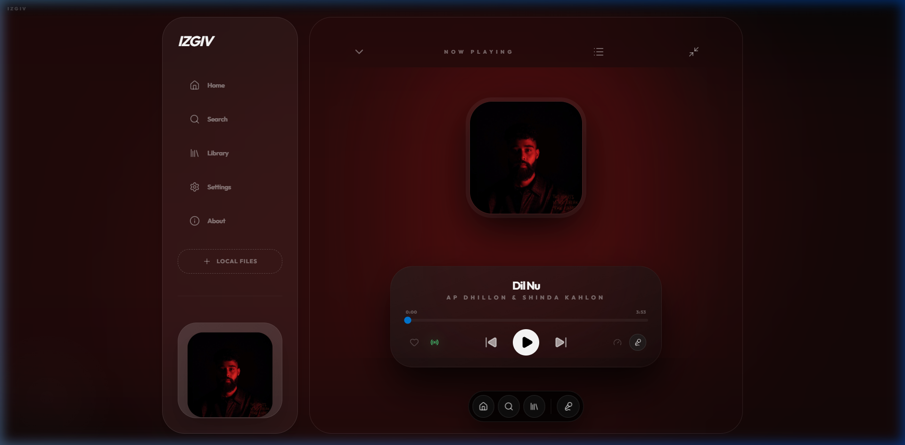
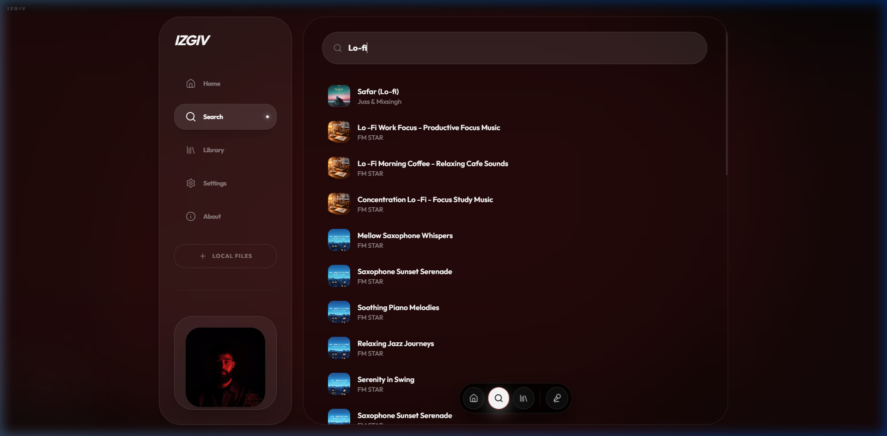
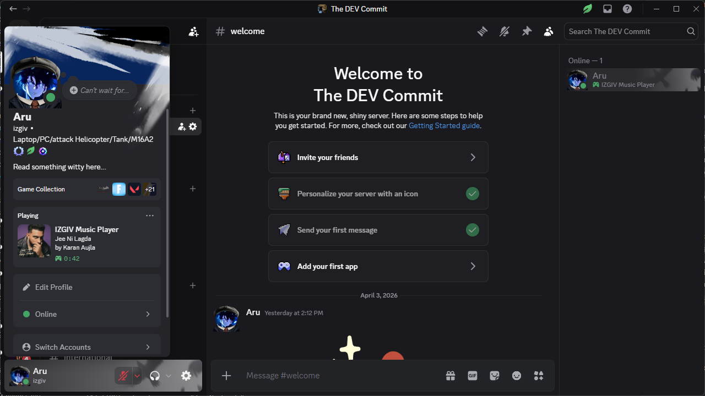

# 🎵 IZGIV Music Player

**Your High-Authority Personal Vibe Space.**
IZGIV is a premium, AI-powered desktop music player built for those who value minimalist aesthetics, high-fidelity audio, and a seamless cloud-local hybrid experience.

---

## ✨ Features

### 🚀 High-Authority UI/UX
- **Glassmorphic Design**: A stunning, modern interface with real-time backdrop blurs and dynamic accent colors that shift based on the current album art.
- **Sidecar Architecture**: Built with a robust Electron Sidecar bridge for reliable, high-performance audio streaming bypassing CORS and network restrictions.
- **Mini-Player**: A compact, always-on-top window for quick playback control while you work.

### 🤖 AI-Powered Discovery
- **Gemini Vibe Shift**: Instantly generate a personalized "Vibe" playlist based on your liked songs using the Gemini 1.5 Pro API.
- **Smart Radio**: Automatically suggests and queues similar tracks when your playlist ends to keep the vibe going.

### ☁️ Hybrid Playback
- **YouTube Music Integration**: Search and stream millions of tracks directly from YouTube Music.
- **Local File Support**: Import and manage your local MP3/FLAC collection with integrated folder watching.
- **High-Fidelity Audio**: Native Node.js streaming proxy for uncompressed audio quality.

### 🌊 Immersive Soundscapes (New v1.1.0)
- **Ambient Soundscape Mixer**: Layer professional-grade atmoshere over your music (Rain, Ocean, Fireplace, Forest, Thunder, Wind).
- **Smart Sleep Timer**: Intelligent volume fade-out over 5 minutes to help you drift off peacefully.
- **10-Band Equalizer**: Fine-tune your audio with a professional peaking-filter EQ engine.
- **Auto-Scroll Lyrics**: Dynamic lyrics sync with precise scroll behavior ensuring the current verse is always centered.

### 🎮 Gaming & Social
- **Modern Discord RPC**: Show off your exact "Now Playing" status on Discord with full album art sync and "Browsing" states.
- **Identity System**: Personalized profiles with custom names and avatars.

---

## 📸 Screenshots

### Immersive Player View

### Intelligent Search

### Discord RPC Engagement

---

## 🛠️ Technical Stack

- **Frontend**: React 18, TypeScript, TailwindCSS
- **Runtime**: Electron
- **Icons**: Lucide React
- **API**: Gemini 1.5 Pro, YouTube Sidecar Bridge
- **Build**: Vite, esbuild

---

## 🤝 Contributing

**We are open to contributors!**
If you want to help make IZGIV even more powerful, here's how you can join:

1. **Fork the repo** and clone it locally.
2. **Install dependencies**: `npm install`
3. **Set up Environment**: Create a `.env.local` with your `GEMINI_API_KEY`.
4. **Run in Dev**: `npm run electron:dev`
5. **Submit a PR**: We love new features, bug fixes, and especially UI refinements!

### Planned Roadmap:
- [x] Built-in audio visualizers (Waveform/Bars).
- [x] Advanced 10-Band EQ Engine.
- [/] Mood-based adaptive themes.
- [ ] Collaborative real-time "Vibe Rooms".
- [ ] Mobile companion app.

---

## 📄 License
Developed by **Aryan Raj Maurya**. Dedicated to the IZGIV ecosystem.
